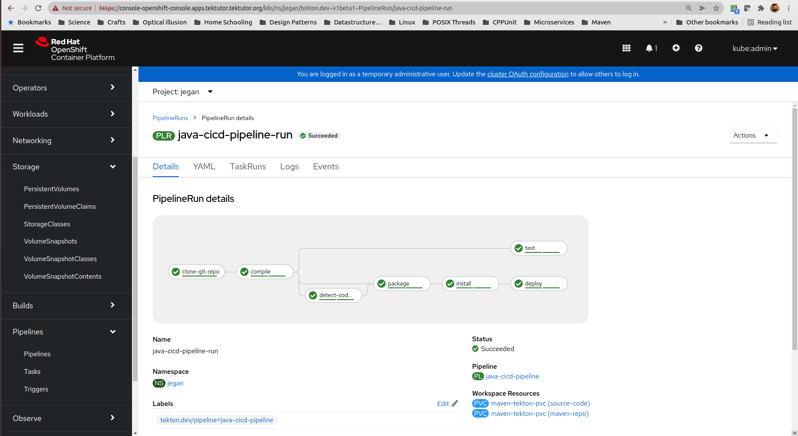

## Create a CI/CD pipeline that compiles, test, packages, performs sonar static code-analysis and deploy the binaries to Artifactory
```
git clone https://github.com/tektutor/openshift-tekton-feb-2022.git
cd Day4/CachingMavenLocalRepo
oc apply -f pipeline.yml
```

The expected output is
<pre>
jegan@tektutor:~/tekton/Day4/CachingMavenLocalRepo$ <b>oc apply -f pipeline.yml</b>
persistentvolume/maven-tekton-pv created
persistentvolumeclaim/maven-tekton-pvc created
pipeline.tekton.dev/java-cicd-pipeline created
pipelinerun.tekton.dev/java-cicd-pipeline-run created
</pre>

Now switch to OpenShift webconsole and select the pipeline run as shown below

