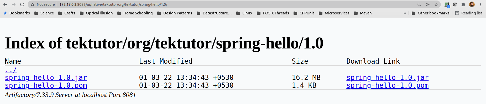
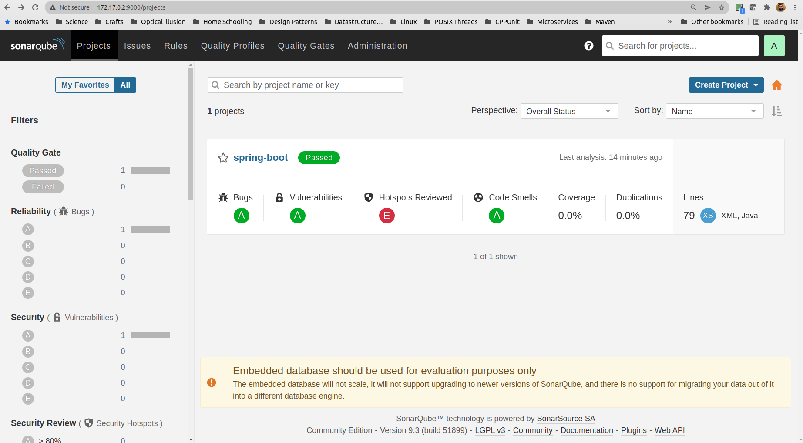

## In the NFS Share folder, under m2 sub-folder edit the settings.xml with the below content
```
<settings>
  <servers>
        <server>
                <id>artifactory</id>
                <username>admin</username>
                <password>Admin@123</password>
        </server>
  </servers>
</settings>
```
The above settings.xml file captures the JFrog Artifactory login credentials.

The respective project pom.xml file looks as shown below
```
<project>
	<modelVersion>4.0.0</modelVersion>
	<parent>
		<groupId>org.springframework.boot</groupId>
		<artifactId>spring-boot-starter-parent</artifactId>
		<version>2.4.2</version>
		<relativePath/> <!-- lookup parent from repository -->
	</parent>
	<groupId>org.tektutor</groupId>
	<artifactId>spring-hello</artifactId>
	<version>1.0</version>
	<name>spring-boot</name>
	<properties>
		<java.version>1.8</java.version>
	</properties>
	<dependencies>
		<dependency>
			<groupId>org.springframework.boot</groupId>
			<artifactId>spring-boot-starter-web</artifactId>
		</dependency>
		<dependency>
			<groupId>org.springframework.boot</groupId>
			<artifactId>spring-boot-starter-test</artifactId>
			<scope>test</scope>
		</dependency>
	</dependencies>

	<build>
		<outputDirectory>../target</outputDirectory>
		<plugins>
			<plugin>
				<groupId>org.apache.maven.plugins</groupId>
				<artifactId>maven-compiler-plugin</artifactId>
				<version>3.8.1</version>
			</plugin>
			<plugin>
				<groupId>org.springframework.boot</groupId>
				<artifactId>spring-boot-maven-plugin</artifactId>
			</plugin>
			<plugin>
				<groupId>org.sonarsource.scanner.maven</groupId>
				<artifactId>sonar-maven-plugin</artifactId>
				<version>3.9.0.2155</version>
			</plugin>
		</plugins>
	</build>
	
	<distributionManagement>
		<repository>
			<id>artifactory</id>
			<url>http://172.17.0.3:8082/artifactory/tektutor/</url>
		</repository>
	</distributionManagement>

</project>
```

## Create a CI/CD pipeline that compiles, test, packages, performs sonar static code-analysis and deploy the binaries to Artifactory
```
git clone https://github.com/tektutor/openshift-tekton-feb-2022.git
cd Day4/CachingMavenLocalRepo
oc apply -f pipeline.yml
```

The expected output is
<pre>
jegan@tektutor:~/tekton/Day4/CachingMavenLocalRepo$ <b>oc apply -f pipeline.yml</b>
persistentvolume/maven-tekton-pv created
persistentvolumeclaim/maven-tekton-pvc created
pipeline.tekton.dev/java-cicd-pipeline created
pipelinerun.tekton.dev/java-cicd-pipeline-run created
</pre>

Now switch to OpenShift webconsole and select the pipeline run as shown below


You may check the deployed files in JFrog Artifactory as shown in the screenshot below


You may check the SonarQube Static Analysis Report as shown in the screenshot below

